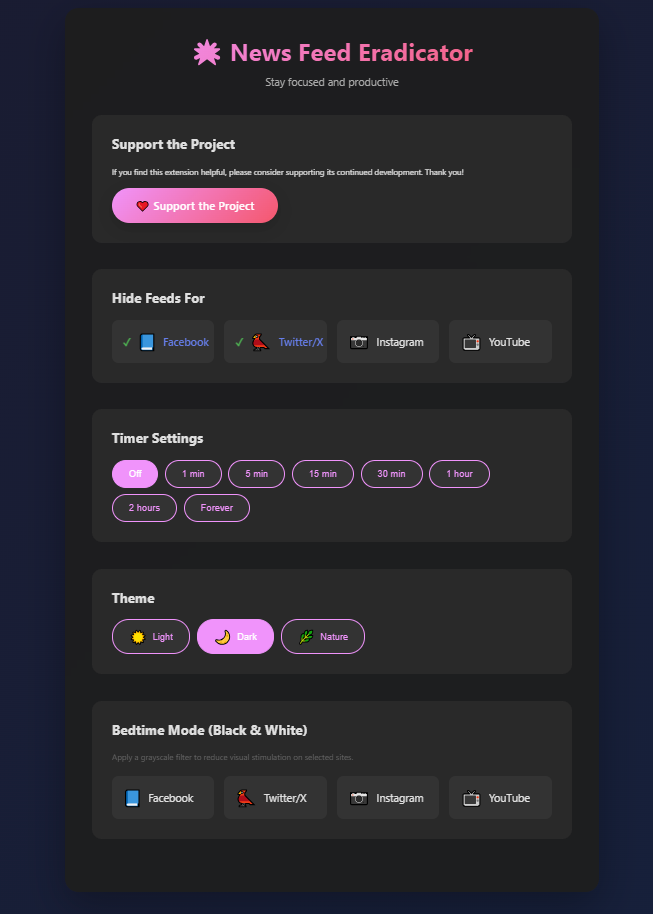

  
   
  <i>Click to download the latest version as a ZIP file</i>

# 🌟 Focus Flow: The Ultimate News Feed Eradicator for Chrome & Firefox

*Keywords: focus, productivity, chrome extension, firefox addon, block distractions, social media blocker, news feed eradicator, digital wellbeing, study tool, anti-procrastination*

---

Focus Flow is a powerful browser extension for Google Chrome and Mozilla Firefox that helps you reclaim your time and attention by replacing distracting social media news feeds with clean, inspirational quotes. If you're looking to boost your productivity, reduce procrastination, and foster a healthier relationship with social media, this is the tool for you.

## 🎯 Why Focus Flow?

In a world full of digital noise, maintaining focus is a superpower. Social media feeds are engineered to be addictive, pulling you into endless scrolling and away from what truly matters. Focus Flow acts as your digital wellbeing companion, blocking these feeds and giving you a moment of peace and inspiration instead.

## ✨ Features

- **Block Distracting Feeds**: Seamlessly hides the news feeds on Facebook, Twitter/X, Instagram, and YouTube.
- **Inspirational Quote Display**: Replaces feeds with a beautiful, rotating collection of quotes from philosophers, poets, and great thinkers.
- **Customizable Themes**: Tailor your experience with three gorgeous themes: **Light**, **Dark**, **Glass** and **Nature**.
- **Flexible Timer**: Grant yourself temporary, controlled access to your feed for a set duration—from one minute to two hours.
- **Bedtime Mode**: Protect your eyes and mind at night with a grayscale (black and white) filter on any supported site.
- **Save & Share Quotes**: Download your favorite quotes as beautiful PNG images to save or share.
- **Custom Quotes**: Add your favourite author's quote.

## 🚀 Installation

### For Google Chrome

1.  Download or clone this repository to your computer.
2.  Open Google Chrome and go to `chrome://extensions`.
3.  Enable **"Developer mode"** using the toggle in the top-right corner.
4.  Click the **"Load unpacked"** button.
5.  Select the `focus-flow-extension` folder.
6.  The extension is now installed and active!

### For Mozilla Firefox

1.  Download or clone this repository to your computer.
2.  Navigate to the `focus-flow-extension` folder.
3.  Rename `manifest_firefox.json` to `manifest.json` (backup the original `manifest.json` first if needed).
4.  Open Firefox and go to `about:debugging#/runtime/this-firefox`.
5.  Click **"Load Temporary Add-on"**.
6.  Select any file in the `focus-flow-extension` folder (e.g., `manifest.json`).
7.  The extension is now installed and active!

**Note for Firefox users:** The temporary add-on will be removed when you close Firefox. For permanent installation, you'll need to package and sign the extension through Firefox Add-ons (AMO), or use Firefox Developer Edition/Nightly with the appropriate settings.

📖 **For detailed Firefox installation instructions, see [FIREFOX_INSTALLATION.md](FIREFOX_INSTALLATION.md)**

📚 **For technical details about browser compatibility, see [BROWSER_SUPPORT.md](BROWSER_SUPPORT.md)**

## 🤝 How to Contribute

Contributions are welcome and greatly appreciated! You can contribute in several ways:

-   **🐛 Report Bugs**: If you find a bug, please open an issue and provide as much detail as possible.
-   **💡 Suggest Features**: Have an idea for a new feature? Open an issue and describe your suggestion.
-   **📝 Improve Documentation**: If you see a way to improve this README or add other documentation, feel free to submit a pull request.
-   **👨‍💻 Submit Code**: Fork the repository, create a new branch for your feature or bug fix, and submit a pull request. Please ensure your code is well-commented and follows the existing style.

We are excited to see what you'll bring to the project!

## 📄 License

This project is licensed under the MIT License. See the `LICENSE` file for more details.

## 🦊 Browser Compatibility Notes

This extension supports both Chrome and Firefox. Here are the key differences:

- **Chrome Version**: Uses `manifest.json` with Manifest V3 and service workers
- **Firefox Version**: Uses `manifest_firefox.json` with Manifest V3 and background scripts (requires Firefox 109+)

The core functionality (content scripts, settings, quotes) works identically across both browsers. The only difference is in the manifest file configuration to accommodate each browser's specific requirements.

### Why Separate Manifest Files?

Chrome uses service workers for background scripts in Manifest V3, while Firefox (even in MV3) uses traditional background scripts. Having separate manifest files ensures optimal compatibility with each browser without compromising functionality.

## ❤️ Support the Project

If Focus Flow helps you stay focused and productive, please consider supporting its continued development. Every little bit helps!

## Screenshots/ Quick look

