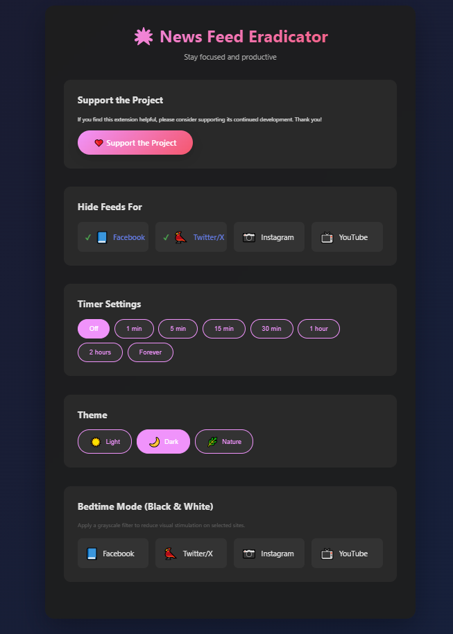

# 🌟 Focus Flow — Reclaim Your Attention

> **Focus Flow** is a powerful browser extension for **Google Chrome** & **Firefox** that helps you reclaim your time and attention by replacing distracting social media news feeds with clean, inspirational quotes.

  

---

## ✨ Features

- 🚫 **Block distracting feeds** on major social media sites.
- 💬 **Show inspirational quotes** instead of endless scrolling content.
- 🎨 **Beautiful themes** (Light, Dark, Glass, Nature).
- ⏱️ **Flexible timer mode** for temporary feed access.
- 🌙 **Bedtime mode** with grayscale focus view.
- 💾 **Save & share quotes** as beautiful images.
- ✍️ **Add your own custom quotes**.

---

## 🚀 Installation

### 🧩 Google Chrome

1. Download or clone this repository.
2. Open `chrome://extensions`.
3. Enable **Developer mode**.
4. Click **Load unpacked**.
5. Select this project folder.

### 🦊 Mozilla Firefox

1. Download or clone this repository.
2. In the project folder, rename `manifest_firefox.json` to `manifest.json`.
3. Open `about:debugging#/runtime/this-firefox`.
4. Click **Load Temporary Add-on**.
5. Select any file from this project folder.

📖 See [FIREFOX_INSTALLATION.md](FIREFOX_INSTALLATION.md) for full Firefox setup details.

---

## 🧭 Usage

1. Open a supported social media website.
2. Focus Flow automatically replaces the distracting feed with quotes.
3. Open extension settings to:
   - switch themes,
   - set feed access timers,
   - enable bedtime mode,
   - add custom quotes.

---

## 🤝 Contributing

Contributions are welcome!

- 🐛 Report bugs via Issues
- 💡 Suggest new features
- 📝 Improve docs
- 👨‍💻 Submit pull requests

Please keep contributions focused, clear, and aligned with the existing style.

---

## 📄 License

This project is licensed under the **MIT License**. See [LICENSE](LICENSE) for details.
